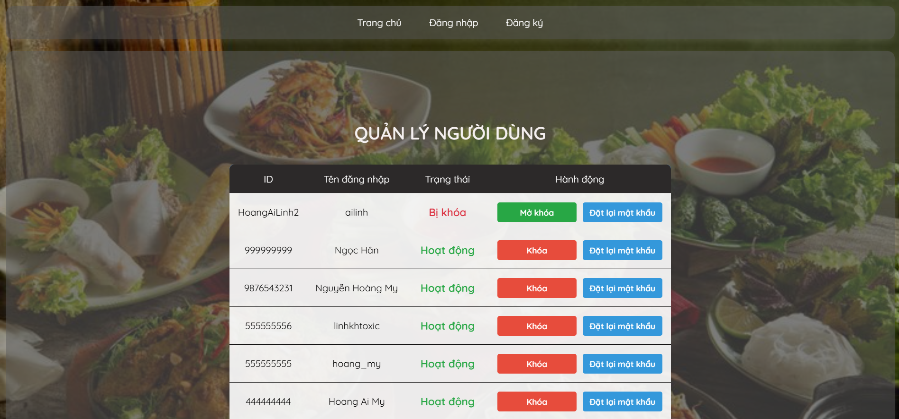
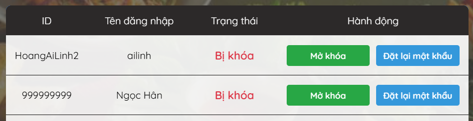
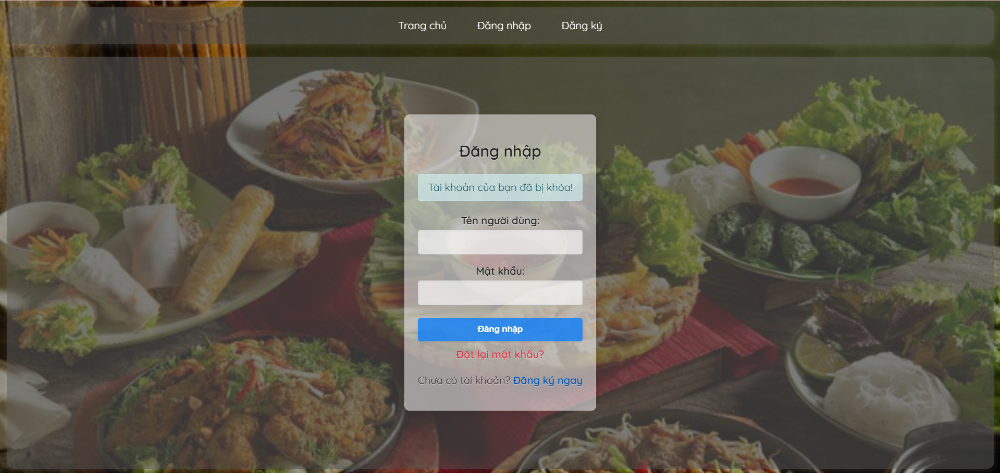
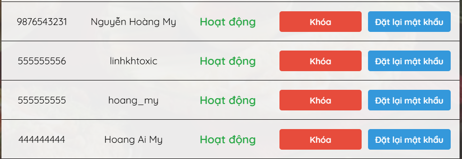
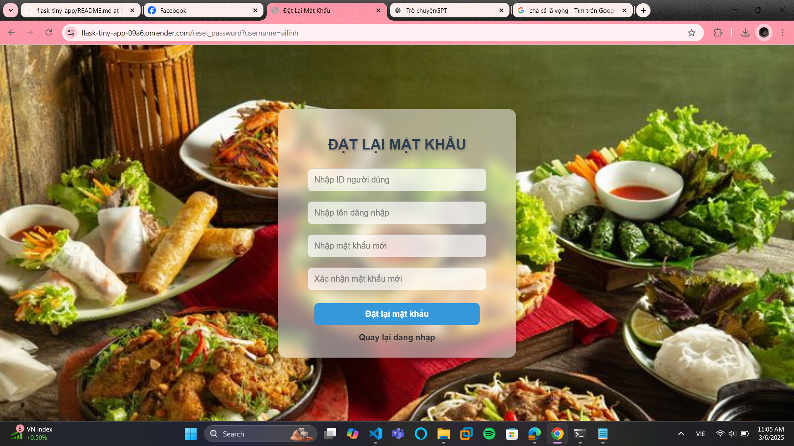

Viết thêm một trang admin dùng để quán lý user. Admin có quyền khóa user (block) và 
reset mật khẩu cho user. Một user nếu bị block thì không thể truy cập vào tài khoản của 
mình. Website phải hiển thị thông báo, tài khoản của bạn đã bị khóa. (release version 
3)

Trang admin quản lý useruser

Admin có quyền khóa user

Admin có quyền reset mật khẩu cho user

