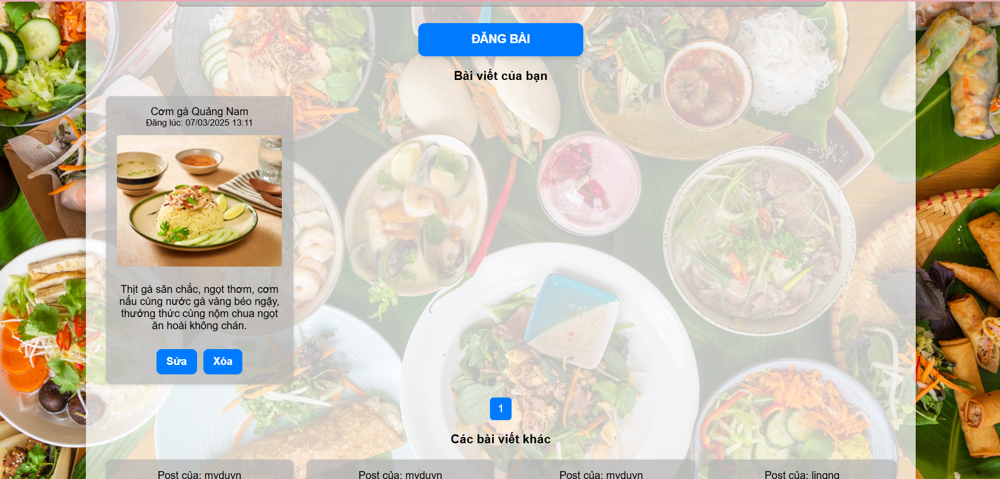

Cho phép user có quyền quản lý bài viết (post) hoặc nhiệm vụ (task) của mình. Hãy 
chỉnh sữa mã để cho phép user có thể thực hiện thao tác xóa cùng lúc trên nhiều posts/ 
tasks cùng lúc (release version 4)

